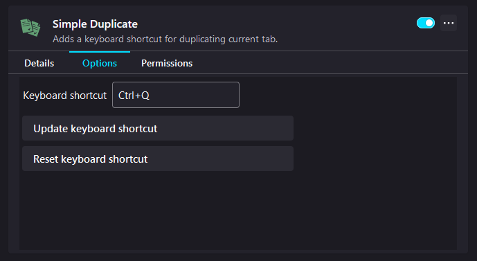

# Simple Duplicate

### The extension that adds a shortcut for duplicating current tab

The goal of this project is to create an extension for Firefox browser that allows to duplicate current tab with the usage of a keyboard shortcut.

The default keyboard shortcut is set as ``Ctrl+Q``, but one can change this in the extension settings.

## Getting Started

These instructions will get you a copy of the project up and running on
your local machine for development and testing purposes.

### Prerequisites

* Mozilla Firefox [version 60.0b5 or above]
* Favorite code editor

To get code completion and suggestions for WebExtensions API in the code editor, use the official [type definitions](https://www.npmjs.com/package/@types/firefox-webext-browser).

Detailed information about installation and configurations are provided at developers' site.

## Technology Stack

* WebExtensions API
* JavaScript
* HTML
* CSS3

## Preview

<table>
    <tr>
        <td>
            
Settings

            
        </td>
    </tr>
</table>

## Author

* **Michał Koziara**